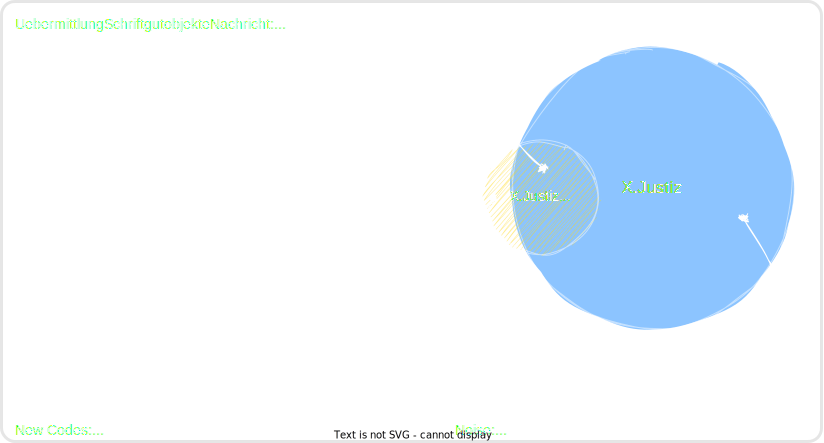

# X.Justiz Core 0.2.0-beta

> [!TIP]  
> **🌐 [Deutsche Version hier verfügbar](README_DE.md) 👈**

X.Justiz Core is a lightweight schema for data exchange between software solutions in the legal ecosystem. It is based on the established X.Justiz standard and optimizes it for out-of-court communication and modern LegalTech scenarios.

## Table of Contents
- [Background](#background)
- [Motivation](#motivation)
- [Goals & Benefits](#goals--benefits)
- [X.Justiz Compatibility](#xjustiz-compatibility)
- [Usage of Codes](#usage-of-codes)
- [Implementation (SDKs)](#implementation-sdks)
- [Specification & Documentation](#specification--documentation)

## Background
The "Arbeitsgruppe Schnittstellen" (Interfaces Working Group) of the [**LegalTech Verband Deutschland**](https://www.legaltechverband.de/) developed this standard in 2024 to make the exchange of legal matters (files) more efficient.

The official [**X.Justiz standard**](https://xjustiz.justiz.de/) serves as the basis, as it is the established benchmark for electronic legal transactions (ERV) in Germany and is maintained by the Federal-State Commission (BLK-AG IT-Standards).

> [!IMPORTANT]  
>We want to hear from you! Whether you have questions, suggestions, bug-reports or want to contribute, we welcome engagement from everyone. Please join our discussions:
> 👉 **[GitHub Discussions](https://github.com/l-pagel/X.Justiz.Core/discussions)**

## Motivation
The classic X.Justiz standard is feature-rich but often too complex for rapid exchange between private market participants. X.Justiz Core addresses the following points:

*   **Reduced Complexity:** Limitation to a practice-relevant subset to avoid "noise" in data exchange.
*   **Modern Technology:** Support for document transfers via pre-signed URLs and format agnosticism (optimized for JSON and XML).
*   **Accessibility:** Bilingual documentation (German/English) for international development teams.
*   **Extension:** Introduction of new keys for legal matters (e.g., succession law, traffic law, tenancy law).
*   **Flexibility:** Flexible transmission of information for which no specific keys currently exist in X.Justiz.

## Goals & Benefits
The goal of X.Justiz Core is efficient interoperability:
*   **Efficiency:** Reduction of effort for individual interfaces between software providers.
*   **Innovation:** Rapid connection of marketplaces and specialized LegalTech products.
*   **Practice Orientation:** Specific extensions for common legal areas such as succession law, traffic law, or tenancy law.
*   **Open Source:** Provided free of charge to promote a networked ecosystem.

## X.Justiz Compatibility
X.Justiz Core is fully compatible with **X.Justiz 3.2.1 through X.Justiz 3.6.2**.  
With some compatibility trade-offs, X.Justiz Core data can also be used compatibly with older versions (up to 2.1.0).

## Usage of Codes
In X.Justiz Core, business data (such as countries, roles, or courts) are identified via standardized **codes / keys**. This ensures machine-readable uniqueness across system boundaries.

### Origin and Management
Most code lists are provided centrally by [**XRepository**](https://www.xrepository.de/). Each list is identifiable via a unique URI and a specific `versionlistid`. This allows for precise tracking of changes to the catalogs (e.g., new countries or changed role designations). For example:

| Entity | Versionlistid | Source |
| ----- | ---------- | ------------------------------------------------------------------------------------------------------------------------------------------------------------------ |
| Country | 2024-08-01 | [XRepository](https://www.xrepository.de/api/xrepository/urn:de:bund:destatis:bevoelkerungsstatistik:schluessel:staat_2024-08-01:technischerBestandteilGenericode) |
| Country | 2023-02-24 | [XRepository](https://www.xrepository.de/api/xrepository/urn:de:bund:destatis:bevoelkerungsstatistik:schluessel:staat_2023-02-24:technischerBestandteilGenericode) |
| ...   | ...        | ...    |

### Application in Data Exchange
In some code lists, there are multiple definitions for individual codes. For instance, in the "Country" code list, the entry for "Germany" has the following values:

| Property | Value |
| --- | --- |
| **Key (Country)** | 000 |
| **Search term** | Deutschland |
| **Short name** | Deutschland |
| **Full name** | die Bundesrepublik Deutschland |
| **Nationality** | deutsch |
| **ISO-Alpha-3** | DEU |
| **ISO-Alpha-2** | DE |

Although the technical code (e.g., `000` for Germany) should primarily be used, X.Justiz also allows the use of alternative representations (e.g., `Deutschland`, `DE`, `DEU`, etc.). X.Justiz Core supports receiving / reading these alternative representations and can map them intelligently to ensure maximum flexibility during implementation.

We still recommend using the codes (e.g., `000` for Germany) primarily. The SDKs automatically use the technical codes when sending / writing data.

### Project Scope
To facilitate development, we have integrated all relevant catalogs directly into our SDKs. Today, there are 3,397 codes in 26 different version lists across 8 main code types (Country, Role, Court, Document Class, etc.).

We have placed special emphasis on documentation: All codes have been elaborately annotated **bilingually (German and English)** with descriptions and summaries to help international development teams get started with the German legal system.

## Implementation (SDKs)
To accelerate integration, the project provides software libraries.
They include:
- [Class library](/dotnet/src/xjustiz.core-dotnet/Models/)
- [Utility tools](/dotnet/src/xjustiz.core-dotnet/Util)
- [Code lists (X.Justiz & X.Justiz Core)](/dotnet/src/xjustiz.core-dotnet/Models/Codes)

The SDKs are available in the following languages:
-   ✅ [**.NET Code**](/dotnet) | [**nuget Package**](https://www.nuget.org/packages/xjustiz.core-dotnet) | [**Getting Started**](/dotnet/README.md)
-   ⏳ **Java (Spring)** (In progress)
-   ⏳ **JavaScript / TypeScript** (In progress)
-   ⏳ **Python** (In progress)

## Specification & Documentation

### X.Justiz Core
- [Specification](Specification.md)
- [Validation rules as XSD](/X.Justiz-Core-Versions)
- [Example datasets](/example-datasets)
- [Lists of used codes](/dotnet/src/xjustiz.core-dotnet/Models/Codes)
- [Changelog (DE)](/Changelog_DE.md), [Changelog (EN)](/Changelog.md)
- [License](LICENSE)

### X.Justiz
- [Archive of all X.Justiz versions and specifications](/X.Justiz-Versions)

## Quality Assurance
The project is regularly checked for quality. You can find the current status on SonarCloud:  
[![Quality Gate][badge-url]][link-url]

[badge-url]: https://sonarcloud.io/api/project_badges/quality_gate?project=l-pagel_X.Justiz.Core&token=63adaa7af33ae168a0611157ea45aaa0db36852f
[link-url]: https://sonarcloud.io/summary/new_code?id=l-pagel_X.Justiz.Core
