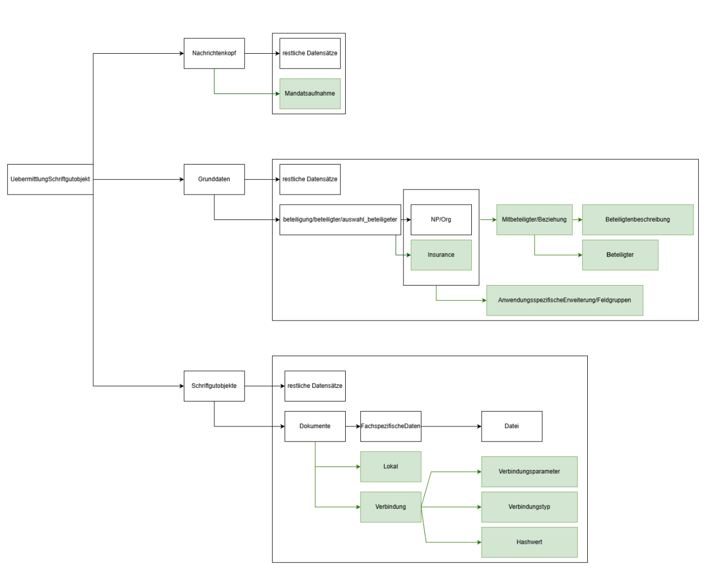
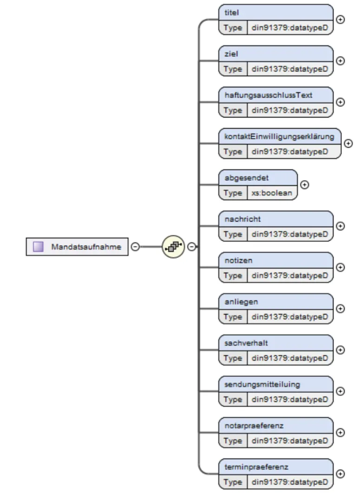

# Xjustiz Change Requests

Im Folgenden sind die Änderungswünsche des Legaltech-Verbandes am XJustiz-Standard schematisch dargestellt. Die beschriebenen Änderungen sind keineswegs abschließend oder formvollendet, sondern dienen als Grundlage für eine genauere Spezifikation eines möglichen Fachmoduls „Außergerichtliche Kommunikation“.

Dazu gehören sowohl das Hinzufügen neuer Typen als auch die Anpassung bestehender Typen (insbesondere der Beteiligten und Dokumente).

Übersicht der Änderungen/Ergänzugnen

### Beteiligte sollen unterbeteiligungen haben können (Kontaktperson, Gesetzl. Vertreter, Versicherungen)

Ein Beteiligter soll in Zukunft auch unterbeteiligungen haben. Das hilft bei der zuordnung von kontaktpersonen oder versicherungen

### Beteiligte sollen um “anwendungspezifische Erweiterungen” ergänzt werden

### Wir benötigen einen neuen Typen für “Außergerichtliche Kommunikation” welche Metadaten enthält die XJustiz über seinen Akten-typ und Basisnachricht-typ nicht abdeckt → z.B Fachmodul “Mandatsannahme”

Im unten stehenden beispiel noch “Mandatsaufnahme” genannt soll dieser neue Typ im Nachrichtenkopf stehen und Metdaten der Fallakte bzw. der Außergerichtlichen kommunikation im allgmeinen enthalten.

### Versicherungen sollen als neuer Typ hinzugefügt werden

### Dokumente müssen auch über “Schnittstellen” abrufbar sein

Wir wollen es in zukunft ermöglichen Dokumente auch über externe Quellen (z.B Download) verfügbar zu machen. Dazu benötigen wir eine Form der Authentifizierung und auch einen Verweis auf die Quelle (z.B Downloadlink)

