# Kündigungsschutzgesetztklage (KSchG Klage)



Mermaid Class Diagramm  
``` Mermaid Class Diagramm
classDiagram
    class KSchGKlage {
        +MandatsZiel ziel
        +Arbeitsverhaeltnis arbeitsverhaeltnis
        +Arbeitgeber arbeitgeber
    }

    class Arbeitsverhaeltnis {
        +Date startDatum
        +Decimal bruttoGehalt
        +String position
        +Boolean istLeitenderAngestellter
        +Integer urlaubsanspruchRest
    }

    class Sonderstatus {
        +Boolean istSchwerbehinderung
        +Boolean istSchwangerschaft
        +Boolean istInElternzeit
        +Boolean istBetriebsratsmitglied
    }

    class Arbeitgeber {
        +XJustizOrganisation unternehmen
        +Integer mitarbeiterAnzahl
        +Boolean istbetriebsratVorhanden
        +Boolean istInInsolvenz
    }

    class Kuendigung {
        +Date zugangsDatum
        +Boolean hatSchriftform
        +KuendigungsArtCode art
        +KuendigungsGrundCode grund
        +String grundDetails
        +XJustizDateiReferenz kuendigungsschreiben
    }
    
    class Abmahnung {
        +Date zugangsDatum
        +Boolean hatSchriftform
        +String grund
        +XJustizDateiReferenz abmahnungsschreiben
    }

    %% Beziehungen
    KSchGKlage --> Arbeitsverhaeltnis : beinhaltet
    KSchGKlage --> Arbeitgeber : beinhaltet
    KSchGKlage --> Kuendigung : beinhaltet
    KSchGKlage "1" --> "*" Abmahnung : beinhaltet
    Kuendigung --> KuendigungsGrundCode : beinhaltet
    Kuendigung --> KuendigungsArtCode : beinhaltet
    Arbeitsverhaeltnis --> Sonderstatus : beinhaltet

    %% Enums (vereinfacht dargestellt)
    class KuendigungsGrundCode {
        <<enumeration>>
        BETRIEBSBEDINGT
        PERSONENBEDINGT
        VERHALTENSBEDINGT
    }

        class KuendigungsArtCode {
        <<enumeration>>
        ORDENTLICH
        FRISTLOS
        AENDERUNGSKUENDIGUNG
    }
```
